# DATABASE.md: BBWS Pompengan Jeneberang

## Entity Relationship Diagram

```mermaid
erDiagram
    ADMIN ||--o{ PAGE : manages
    ADMIN ||--o{ SERVICE : manages
    ADMIN ||--o{ PORTFOLIO_PROJECT : manages
    ADMIN ||--o{ TEAM_MEMBER : manages
    ADMIN ||--o{ BLOG_POST : manages
    ADMIN ||--o{ TESTIMONIAL : manages
    ADMIN ||--o{ CONTACT_SUBMISSION : receives
    ADMIN ||--o{ MEDIA : uploads
    ADMIN ||--o{ CONTENT_VERSION : creates
    ADMIN ||--o{ GLOBAL_SETTING : manages
    ADMIN ||--o{ REGION : manages
    ADMIN ||--o{ EMPLOYEE : manages
    ADMIN ||--o{ ANNOUNCEMENT : creates
    SERVICE ||--o{ PORTFOLIO_PROJECT : "has many"
    BLOG_POST ||--o{ BLOG_TAG : "tagged with"
    BLOG_POST ||--o{ BLOG_CATEGORY : "belongs to"
    PORTFOLIO_PROJECT ||--o{ PORTFOLIO_IMAGE : "has many"
    PAGE ||--o{ CONTENT_VERSION : "has many"
    MEDIA ||--o{ PORTFOLIO_IMAGE : "references"
    REGION ||--o{ ADMIN : "has many"
    REGION ||--o{ EMPLOYEE : "has many"
    REGION ||--o{ ATTENDANCE : "has many"
    REGION ||--o{ ANNOUNCEMENT : "has many"
    EMPLOYEE ||--o{ ATTENDANCE : "has many"
    EMPLOYEE ||--o{ LEAVE_REQUEST : "has many"
    EMPLOYEE ||--o{ ANNOUNCEMENT_READ : "has many"
    EMPLOYEE ||--o{ LOVE_CLAIM : "has many"
    EMPLOYEE ||--o{ LOVE_BALANCE : "has many"
    ANNOUNCEMENT ||--o{ ANNOUNCEMENT_READ : "has many"

    ADMIN {
        int id PK
        string email
        string password
        string name
        string role
        int region_id FK
        timestamp email_verified_at
        timestamp created_at
        timestamp updated_at
    }

    REGION {
        int id PK
        string name
        string slug
        string kantor_name
        string tipe
        decimal lat
        decimal lng
        int radius_m
        string address
        boolean is_active
        timestamp created_at
        timestamp updated_at
    }

    EMPLOYEE {
        int id PK
        string nik
        string nip
        string name
        string golongan
        string jabatan
        string unit_kerja
        string status_kepegawaian
        int region_id FK
        string password
        string foto_url
        string email
        string phone
        timestamp created_at
        timestamp updated_at
    }

    ATTENDANCE {
        int id PK
        int employee_id FK
        int region_id FK
        string type
        timestamp timestamp
        decimal lat
        decimal lng
        string selfie_url
        string status
        string device_info
        timestamp created_at
    }

    LEAVE_REQUEST {
        int id PK
        int employee_id FK
        int region_id FK
        string jenis
        date tgl_mulai
        date tgl_selesai
        text alasan
        string dokumen_url
        string status
        int current_approver_level
        timestamp created_at
        timestamp updated_at
    }

    ANNOUNCEMENT {
        int id PK
        string title
        text content
        string attachment_url
        string scope
        int region_id FK
        int created_by FK
        timestamp published_at
        boolean is_pinned
        timestamp created_at
        timestamp updated_at
    }

    ANNOUNCEMENT_READ {
        int id PK
        int announcement_id FK
        int employee_id FK
        timestamp read_at
    }

    LOVE_BALANCE {
        int id PK
        int employee_id FK
        string period
        int love_sisa
        int love_max
        timestamp reset_at
    }

    LOVE_CLAIM {
        int id PK
        int employee_id FK
        int attendance_id FK
        int region_id FK
        text alasan
        string dokumen_url
        string status
        timestamp created_at
    }

    PAGE {
        int id PK
        string slug
        string title
        text content
        string meta_title
        string meta_description
        text meta_og_image
        string meta_og_title
        string meta_og_description
        boolean is_published
        timestamp created_at
        timestamp updated_at
    }

    SERVICE {
        int id PK
        string slug
        string title
        text description
        text short_description
        string icon_url
        int display_order
        boolean is_published
        timestamp created_at
        timestamp updated_at
    }

    PORTFOLIO_PROJECT {
        int id PK
        string slug
        string title
        text description
        int service_id FK
        string client_name
        date project_date
        string meta_title
        string meta_description
        boolean is_published
        timestamp created_at
        timestamp updated_at
    }

    PORTFOLIO_IMAGE {
        int id PK
        int portfolio_project_id FK
        int media_id FK
        int display_order
        string alt_text
        timestamp created_at
    }

    TEAM_MEMBER {
        int id PK
        string name
        string title
        text bio
        int media_id FK
        string email
        string phone
        string linkedin_url
        int display_order
        boolean is_published
        timestamp created_at
        timestamp updated_at
    }

    BLOG_POST {
        int id PK
        string slug
        string title
        text content
        int blog_category_id FK
        string author
        string status
        string meta_title
        string meta_description
        timestamp published_at
        timestamp created_at
        timestamp updated_at
    }

    BLOG_CATEGORY {
        int id PK
        string slug
        string name
        text description
        timestamp created_at
        timestamp updated_at
    }

    BLOG_TAG {
        int id PK
        string slug
        string name
        timestamp created_at
        timestamp updated_at
    }

    TESTIMONIAL {
        int id PK
        string client_name
        string client_company
        text message
        string status
        int display_order
        timestamp created_at
        timestamp updated_at
    }

    CONTACT_SUBMISSION {
        int id PK
        string name
        string email
        string subject
        text message
        string status
        timestamp created_at
        timestamp updated_at
    }

    MEDIA {
        int id PK
        string filename
        string original_filename
        string mime_type
        bigint file_size
        string s3_path
        string s3_url
        string media_type
        timestamp created_at
        timestamp updated_at
    }

    CONTENT_VERSION {
        int id PK
        int page_id FK
        text content
        string meta_title
        string meta_description
        int admin_id FK
        text change_notes
        timestamp created_at
    }

    GLOBAL_SETTING {
        int id PK
        string setting_key
        text setting_value
        timestamp created_at
        timestamp updated_at
    }
```



## Table Definitions

### ADMIN
Stores administrator accounts with role & region scoping (Super Admin vs Admin Wilayah).

| Column | Type | Constraints | Description |
|:---|:---|:---|:---|
| id | INT | PK, AUTO_INCREMENT | Unique identifier |
| email | VARCHAR(255) | UK, NOT NULL | Admin login email |
| password | VARCHAR(255) | NOT NULL | Hashed password (bcrypt) |
| name | VARCHAR(255) | NOT NULL | Administrator full name |
| role | ENUM('super_admin','admin_wilayah') | DEFAULT 'admin_wilayah' | RBAC role |
| region_id | INT | FK (REGION.id), NULLABLE | Assigned region (NULL for Super Admin) |
| email_verified_at | TIMESTAMP | NULLABLE | Email verification timestamp |
| created_at | TIMESTAMP | DEFAULT CURRENT_TIMESTAMP | Record creation time |
| updated_at | TIMESTAMP | DEFAULT CURRENT_TIMESTAMP ON UPDATE | Last update time |

### REGION
Stores Kantor BBWS PJ per wilayah — **Pusat Makassar + Cabang Kabupaten/Kota se-Sulsel** (24 wilayah). Tiap kantor punya lokasi + radius absen yang di-input admin untuk validasi geofence karyawan.

| Column | Type | Constraints | Description |
|:---|:---|:---|:---|
| id | INT | PK, AUTO_INCREMENT | Unique identifier |
| name | VARCHAR(255) | NOT NULL | Nama wilayah (e.g., "Kabupaten Gowa", "Kota Makassar (Pusat)") |
| slug | VARCHAR(255) | UK, NOT NULL | URL-friendly identifier (e.g., "gowa", "makassar-pusat") |
| kantor_name | VARCHAR(255) | NOT NULL | Nama kantor (e.g., "Kantor BBWS PJ Kab. Gowa", "Kantor Pusat BBWS Pompengan Jeneberang - Makassar") |
| tipe | ENUM('pusat','cabang') | DEFAULT 'cabang' | Tipe kantor: pusat (hanya Makassar) vs cabang |
| lat | DECIMAL(10,8) | NOT NULL | Lokasi kantor latitude — di-input admin via map picker |
| lng | DECIMAL(11,8) | NOT NULL | Lokasi kantor longitude — di-input admin via map picker |
| radius_m | INT | DEFAULT 200 | Radius absen dalam meter (50–1000, input admin, default 200m). Geofence untuk validasi GPS karyawan cabang tersebut |
| address | TEXT | NULLABLE | Alamat lengkap kantor |
| is_active | BOOLEAN | DEFAULT 1 | Active flag |
| created_at | TIMESTAMP | DEFAULT CURRENT_TIMESTAMP | Record creation time |
| updated_at | TIMESTAMP | DEFAULT CURRENT_TIMESTAMP ON UPDATE | Last update time |

**Catatan domain Sulsel:** Seed awal 24 wilayah: Pusat Makassar + 21 Kabupaten (Bantaeng, Barru, Bone, Bulukumba, Enrekang, Gowa, Jeneponto, Kepulauan Selayar, Luwu, Luwu Timur, Luwu Utara, Maros, Pangkajene dan Kepulauan, Pinrang, Sinjai, Soppeng, Takalar, Toraja Utara, Tana Toraja, Wajo) + 2 Kota selain Makassar (Parepare, Palopo) — atau 3 Kota total termasuk Makassar sebagai pusat. Super Admin di Makassar CRUD ini; Admin Cabang dapat edit lat/lng/radius kantornya sendiri.

### EMPLOYEE
Stores karyawan Lengkap HR data, linked to region, auth via NIK + password. Own-data-only policy.

| Column | Type | Constraints | Description |
|:---|:---|:---|:---|
| id | INT | PK, AUTO_INCREMENT | Unique identifier |
| nik | VARCHAR(16) | UK, NOT NULL | 16-digit NIK (login) |
| nip | VARCHAR(255) | UK, NULLABLE | NIP (optional unique) |
| name | VARCHAR(255) | NOT NULL | Full name |
| golongan | VARCHAR(50) | NULLABLE | Rank/group (e.g., III/a) |
| jabatan | VARCHAR(255) | NOT NULL | Position |
| unit_kerja | VARCHAR(255) | NOT NULL | Work unit |
| status_kepegawaian | ENUM('PNS','PPPK','Kontrak','Honorer') | NOT NULL | Employment status |
| region_id | INT | FK (REGION.id), NOT NULL | Assigned region |
| password | VARCHAR(255) | NOT NULL | Hashed password (bcrypt) |
| foto_url | VARCHAR(255) | NULLABLE | S3 URL of photo |
| email | VARCHAR(255) | NULLABLE | Contact email |
| phone | VARCHAR(20) | NULLABLE | Contact phone |
| created_at | TIMESTAMP | DEFAULT CURRENT_TIMESTAMP | Record creation time |
| updated_at | TIMESTAMP | DEFAULT CURRENT_TIMESTAMP ON UPDATE | Last update time |

### ATTENDANCE
Stores GPS+selfie absensi records, region-scoped.

| Column | Type | Constraints | Description |
|:---|:---|:---|:---|
| id | INT | PK, AUTO_INCREMENT | Unique identifier |
| employee_id | INT | FK (EMPLOYEE.id) | Employee |
| region_id | INT | FK (REGION.id) | Region (denormalized for query) |
| type | ENUM('in','out') | NOT NULL | Check-in/out |
| timestamp | TIMESTAMP | NOT NULL | Attendance time |
| lat | DECIMAL(10,8) | NOT NULL | GPS lat |
| lng | DECIMAL(11,8) | NOT NULL | GPS lng |
| selfie_url | VARCHAR(255) | NOT NULL | S3 URL of selfie |
| status | ENUM('on_time','late','early_leave','excused_love') | NOT NULL | Validation status (tidak ada out_of_range — di luar radius ditolak 422, tidak tercatat) |
| device_info | VARCHAR(255) | NULLABLE | Device metadata |
| created_at | TIMESTAMP | DEFAULT CURRENT_TIMESTAMP | Record creation time |

### LEAVE_REQUEST
Stores cuti berjenjang requests.

| Column | Type | Constraints | Description |
|:---|:---|:---|:---|
| id | INT | PK, AUTO_INCREMENT | Unique identifier |
| employee_id | INT | FK (EMPLOYEE.id) | Requester |
| region_id | INT | FK (REGION.id) | Region |
| jenis | ENUM('tahunan','sakit','besar','lainnya') | NOT NULL | Leave type |
| tgl_mulai | DATE | NOT NULL | Start date |
| tgl_selesai | DATE | NOT NULL | End date |
| alasan | TEXT | NOT NULL | Reason |
| dokumen_url | VARCHAR(255) | NULLABLE | S3 supporting doc |
| status | ENUM('pending','approved_level1','approved_level2','approved','rejected') | DEFAULT 'pending' | Workflow status |
| current_approver_level | INT | DEFAULT 1 | Current level (1=Atasan,2=AdminWilayah,3=SuperAdmin) |
| approved_by_level1 | INT | FK (ADMIN.id/EMPLOYEE.id) NULLABLE | Level1 approver |
| approved_by_level2 | INT | FK (ADMIN.id) NULLABLE | Level2 approver |
| approved_by_level3 | INT | FK (ADMIN.id) NULLABLE | Final approver |
| created_at | TIMESTAMP | DEFAULT CURRENT_TIMESTAMP | Record creation time |
| updated_at | TIMESTAMP | DEFAULT CURRENT_TIMESTAMP ON UPDATE | Last update time |

### ANNOUNCEMENT
Stores pengumuman broadcast or wilayah-targeted.

| Column | Type | Constraints | Description |
|:---|:---|:---|:---|
| id | INT | PK, AUTO_INCREMENT | Unique identifier |
| title | VARCHAR(255) | NOT NULL | Title |
| content | LONGTEXT | NOT NULL | HTML content |
| attachment_url | VARCHAR(255) | NULLABLE | S3 attachment |
| scope | ENUM('global','region') | NOT NULL | Broadcast scope |
| region_id | INT | FK (REGION.id), NULLABLE | Target region (if region scope) |
| created_by | INT | FK (ADMIN.id) | Creator |
| published_at | TIMESTAMP | NULLABLE | Publish time |
| is_pinned | BOOLEAN | DEFAULT 0 | Pinned flag |
| created_at | TIMESTAMP | DEFAULT CURRENT_TIMESTAMP | Record creation time |
| updated_at | TIMESTAMP | DEFAULT CURRENT_TIMESTAMP ON UPDATE | Last update time |

### ANNOUNCEMENT_READ
Pivot for read/unread status per karyawan.

| Column | Type | Constraints | Description |
|:---|:---|:---|:---|
| id | INT | PK, AUTO_INCREMENT | Unique identifier |
| announcement_id | INT | FK (ANNOUNCEMENT.id) | Announcement |
| employee_id | INT | FK (EMPLOYEE.id) | Reader |
| read_at | TIMESTAMP | NOT NULL | Read timestamp |

### LOVE_BALANCE
Stores per-employee per-month Love balance, reset bulanan, fleksibel total love.

| Column | Type | Constraints | Description |
|:---|:---|:---|:---|
| id | INT | PK, AUTO_INCREMENT | Unique identifier |
| employee_id | INT | FK (EMPLOYEE.id) | Employee |
| period | VARCHAR(7) | NOT NULL | YYYY-MM (e.g., 2026-08) |
| love_sisa | INT | DEFAULT 4 | Remaining hearts this month (0–love_max) |
| love_max | INT | DEFAULT 4 | Max hearts for this period (copied from global love_max_default at reset) |
| reset_at | TIMESTAMP | NOT NULL | Reset timestamp (1st 00:00 WITA) |
| created_at | TIMESTAMP | DEFAULT CURRENT_TIMESTAMP | Record creation time |
| updated_at | TIMESTAMP | DEFAULT CURRENT_TIMESTAMP ON UPDATE | Last update time |

### LOVE_CLAIM
Stores Love Claim for late dalam radius, 1 level Admin Cabang approval, hari yang sama.

| Column | Type | Constraints | Description |
|:---|:---|:---|:---|
| id | INT | PK, AUTO_INCREMENT | Unique identifier |
| employee_id | INT | FK (EMPLOYEE.id) | Claimant |
| attendance_id | INT | FK (ATTENDANCE.id), UK | Attendance late dalam radius (one claim per attendance) |
| region_id | INT | FK (REGION.id) | Region (for scoping) |
| alasan | TEXT | NOT NULL | Reason (max 500) |
| dokumen_url | VARCHAR(255) | NULLABLE | S3 PDF/image dokumen |
| status | ENUM('pending','approved','rejected') | DEFAULT 'pending' | Approval status (1 level Admin Cabang) |
| reviewed_by | INT | FK (ADMIN.id) NULLABLE | Admin Cabang reviewer |
| reviewed_at | TIMESTAMP | NULLABLE | Review time |
| created_at | TIMESTAMP | DEFAULT CURRENT_TIMESTAMP | Claim time (must be same day (00:00–23:59 WITA) of attendance) |
| updated_at | TIMESTAMP | DEFAULT CURRENT_TIMESTAMP ON UPDATE | Last update time |

### PAGE
Stores static page content (About Us, Services overview, etc.). Each page has a unique slug for URL generation.

| Column | Type | Constraints | Description |
|:---|:---|:---|:---|
| id | INT | PK, AUTO_INCREMENT | Unique identifier |
| slug | VARCHAR(255) | UK, NOT NULL | URL-friendly identifier (e.g., "about-us") |
| title | VARCHAR(255) | NOT NULL | Page title |
| content | LONGTEXT | NOT NULL | WYSIWYG editor content (HTML) |
| meta_title | VARCHAR(255) | NULLABLE | SEO meta title |
| meta_description | VARCHAR(255) | NULLABLE | SEO meta description |
| meta_og_image | TEXT | NULLABLE | Open Graph image URL |
| meta_og_title | VARCHAR(255) | NULLABLE | Open Graph title |
| meta_og_description | VARCHAR(255) | NULLABLE | Open Graph description |
| is_published | BOOLEAN | DEFAULT 1 | Publication status |
| created_at | TIMESTAMP | DEFAULT CURRENT_TIMESTAMP | Record creation time |
| updated_at | TIMESTAMP | DEFAULT CURRENT_TIMESTAMP ON UPDATE | Last update time |

### SERVICE
Stores company service offerings. Each service can be linked to multiple portfolio projects.

| Column | Type | Constraints | Description |
|:---|:---|:---|:---|
| id | INT | PK, AUTO_INCREMENT | Unique identifier |
| slug | VARCHAR(255) | UK, NOT NULL | URL-friendly identifier |
| title | VARCHAR(255) | NOT NULL | Service name |
| description | LONGTEXT | NOT NULL | Detailed service description |
| short_description | TEXT | NULLABLE | Brief summary for listings |
| icon_url | VARCHAR(255) | NULLABLE | URL to service icon (S3) |
| display_order | INT | DEFAULT 0 | Sort order on public page |
| is_published | BOOLEAN | DEFAULT 1 | Publication status |
| created_at | TIMESTAMP | DEFAULT CURRENT_TIMESTAMP | Record creation time |
| updated_at | TIMESTAMP | DEFAULT CURRENT_TIMESTAMP ON UPDATE | Last update time |

### PORTFOLIO_PROJECT
Stores completed projects/case studies. Links to services and contains multiple images via PORTFOLIO_IMAGE.

| Column | Type | Constraints | Description |
|:---|:---|:---|:---|
| id | INT | PK, AUTO_INCREMENT | Unique identifier |
| slug | VARCHAR(255) | UK, NOT NULL | URL-friendly identifier |
| title | VARCHAR(255) | NOT NULL | Project title |
| description | LONGTEXT | NOT NULL | Project details and outcomes |
| service_id | INT | FK (SERVICE.id) | Associated service category |
| client_name | VARCHAR(255) | NOT NULL | Client company name |
| project_date | DATE | NOT NULL | Project completion date |
| meta_title | VARCHAR(255) | NULLABLE | SEO meta title |
| meta_description | VARCHAR(255) | NULLABLE | SEO meta description |
| is_published | BOOLEAN | DEFAULT 1 | Publication status |
| created_at | TIMESTAMP | DEFAULT CURRENT_TIMESTAMP | Record creation time |
| updated_at | TIMESTAMP | DEFAULT CURRENT_TIMESTAMP ON UPDATE | Last update time |

### PORTFOLIO_IMAGE
Junction table linking portfolio projects to media files. Supports multiple images per project with display order.

| Column | Type | Constraints | Description |
|:---|:---|:---|:---|
| id | INT | PK, AUTO_INCREMENT | Unique identifier |
| portfolio_project_id | INT | FK (PORTFOLIO_PROJECT.id) | Associated project |
| media_id | INT | FK (MEDIA.id) | Associated media file |
| display_order | INT | DEFAULT 0 | Image order in gallery |
| alt_text | VARCHAR(255) | NULLABLE | Accessibility alt text |
| created_at | TIMESTAMP | DEFAULT CURRENT_TIMESTAMP | Record creation time |

### TEAM_MEMBER
Stores team member profiles with photos and contact information.

| Column | Type | Constraints | Description |
|:---|:---|:---|:---|
| id | INT | PK, AUTO_INCREMENT | Unique identifier |
| name | VARCHAR(255) | NOT NULL | Team member full name |
| title | VARCHAR(255) | NOT NULL | Job title/position |
| bio | TEXT | NULLABLE | Brief biography |
| media_id | INT | FK (MEDIA.id), NULLABLE | Profile photo |
| email | VARCHAR(255) | NULLABLE | Contact email |
| phone | VARCHAR(20) | NULLABLE | Contact phone |
| linkedin_url | VARCHAR(255) | NULLABLE | LinkedIn profile URL |
| display_order | INT | DEFAULT 0 | Sort order on team page |
| is_published | BOOLEAN | DEFAULT 1 | Publication status |
| created_at | TIMESTAMP | DEFAULT CURRENT_TIMESTAMP | Record creation time |
| updated_at | TIMESTAMP | DEFAULT CURRENT_TIMESTAMP ON UPDATE | Last update time |

### BLOG_POST
Stores blog articles with categorization, tagging, and publication workflow.

| Column | Type | Constraints | Description |
|:---|:---|:---|:---|
| id | INT | PK, AUTO_INCREMENT | Unique identifier |
| slug | VARCHAR(255) | UK, NOT NULL | URL-friendly identifier |
| title | VARCHAR(255) | NOT NULL | Article title |
| content | LONGTEXT | NOT NULL | Article body (HTML from WYSIWYG) |
| blog_category_id | INT | FK (BLOG_CATEGORY.id), NULLABLE | Article category |
| author | VARCHAR(255) | NOT NULL | Author name |
| status | ENUM('draft','published','archived') | DEFAULT 'draft' | Publication status |
| meta_title | VARCHAR(255) | NULLABLE | SEO meta title |
| meta_description | VARCHAR(255) | NULLABLE | SEO meta description |
| published_at | TIMESTAMP | NULLABLE | Publication timestamp |
| created_at | TIMESTAMP | DEFAULT CURRENT_TIMESTAMP | Record creation time |
| updated_at | TIMESTAMP | DEFAULT CURRENT_TIMESTAMP ON UPDATE | Last update time |

### BLOG_CATEGORY
Stores blog post categories for organization and filtering.

| Column | Type | Constraints | Description |
|:---|:---|:---|:---|
| id | INT | PK, AUTO_INCREMENT | Unique identifier |
| slug | VARCHAR(255) | UK, NOT NULL | URL-friendly identifier |
| name | VARCHAR(255) | NOT NULL | Category name |
| description | TEXT | NULLABLE | Category description |
| created_at | TIMESTAMP | DEFAULT CURRENT_TIMESTAMP | Record creation time |
| updated_at | TIMESTAMP | DEFAULT CURRENT_TIMESTAMP ON UPDATE | Last update time |

### BLOG_TAG
Stores blog post tags for flexible content organization.

| Column | Type | Constraints | Description |
|:---|:---|:---|:---|
| id | INT | PK, AUTO_INCREMENT | Unique identifier |
| slug | VARCHAR(255) | UK, NOT NULL | URL-friendly identifier |
| name | VARCHAR(255) | NOT NULL | Tag name |
| created_at | TIMESTAMP | DEFAULT CURRENT_TIMESTAMP | Record creation time |
| updated_at | TIMESTAMP | DEFAULT CURRENT_TIMESTAMP ON UPDATE | Last update time |

### TESTIMONIAL
Stores client testimonials with approval workflow for public display.

| Column | Type | Constraints | Description |
|:---|:---|:---|:---|
| id | INT | PK, AUTO_INCREMENT | Unique identifier |
| client_name | VARCHAR(255) | NOT NULL | Testimonial author name |
| client_company | VARCHAR(255) | NULLABLE | Client company name |
| message | TEXT | NOT NULL | Testimonial text |
| status | ENUM('pending','approved','rejected') | DEFAULT 'pending' | Approval status |
| display_order | INT | DEFAULT 0 | Sort order on public page |
| created_at | TIMESTAMP | DEFAULT CURRENT_TIMESTAMP | Record creation time |
| updated_at | TIMESTAMP | DEFAULT CURRENT_TIMESTAMP ON UPDATE | Last update time |

### CONTACT_SUBMISSION
Stores contact form submissions from public visitors.

| Column | Type | Constraints | Description |
|:---|:---|:---|:---|
| id | INT | PK, AUTO_INCREMENT | Unique identifier |
| name | VARCHAR(255) | NOT NULL | Visitor name |
| email | VARCHAR(255) | NOT NULL | Visitor email |
| subject | VARCHAR(255) | NOT NULL | Message subject |
| message | TEXT | NOT NULL | Message body |
| status | ENUM('new','read','archived') | DEFAULT 'new' | Admin review status |
| created_at | TIMESTAMP | DEFAULT CURRENT_TIMESTAMP | Submission timestamp |
| updated_at | TIMESTAMP | DEFAULT CURRENT_TIMESTAMP ON UPDATE | Last update time |

### MEDIA
Stores metadata for all uploaded files stored on AWS S3.

| Column | Type | Constraints | Description |
|:---|:---|:---|:---|
| id | INT | PK, AUTO_INCREMENT | Unique identifier |
| filename | VARCHAR(255) | NOT NULL | Stored filename on S3 |
| original_filename | VARCHAR(255) | NOT NULL | Original uploaded filename |
| mime_type | VARCHAR(100) | NOT NULL | File MIME type (e.g., image/jpeg) |
| file_size | BIGINT | NOT NULL | File size in bytes |
| s3_path | VARCHAR(255) | NOT NULL | Full S3 object path |
| s3_url | VARCHAR(255) | NOT NULL | Public S3 URL (CloudFront or direct) |
| media_type | ENUM('image','video','document') | DEFAULT 'image' | Content type classification |
| created_at | TIMESTAMP | DEFAULT CURRENT_TIMESTAMP | Upload timestamp |
| updated_at | TIMESTAMP | DEFAULT CURRENT_TIMESTAMP ON UPDATE | Last update time |

### CONTENT_VERSION
Stores historical versions of page content for rollback capability (FR-20).

| Column | Type | Constraints | Description |
|:---|:---|:---|:---|
| id | INT | PK, AUTO_INCREMENT | Unique identifier |
| page_id | INT | FK (PAGE.id) | Associated page |
| content | LONGTEXT | NOT NULL | Snapshot of page content |
| meta_title | VARCHAR(255) | NULLABLE | Snapshot of meta title |
| meta_description | VARCHAR(255) | NULLABLE | Snapshot of meta description |
| admin_id | INT | FK (ADMIN.id) | Administrator who made the change |
| change_notes | TEXT | NULLABLE | Admin notes about the change |
| created_at | TIMESTAMP | DEFAULT CURRENT_TIMESTAMP | Version creation timestamp |

### GLOBAL_SETTING
Stores site-wide configuration settings (company name, logo, contact info, social links, **and global jam kerja**).

| Column | Type | Constraints | Description |
|:---|:---|:---|:---|
| id | INT | PK, AUTO_INCREMENT | Unique identifier |
| setting_key | VARCHAR(255) | UK, NOT NULL | Setting identifier (e.g., "company_name", "jam_masuk", "jam_pulang", "toleransi_late_menit", "hari_kerja") |
| setting_value | TEXT | NOT NULL | Setting value (JSON for complex data; jam_masuk="07:30", jam_pulang="16:00", toleransi=15, hari_kerja=["Senin","Selasa","Rabu","Kamis","Jumat"]) |
| created_at | TIMESTAMP | DEFAULT CURRENT_TIMESTAMP | Record creation time |
| updated_at | TIMESTAMP | DEFAULT CURRENT_TIMESTAMP ON UPDATE | Last update time |

**Global Jam Kerja (WITA):** Keys `jam_masuk` (TIME 07:30 default), `jam_pulang` (16:00), `toleransi_late_menit` (15), `hari_kerja` (JSON array), `timezone` (Asia/Makassar). Only Super Admin Pusat can edit; cached Redis `settings:jam_kerja`. Used server-side to compute attendance status: `check-in <= jam_masuk+toleransi → on_time` else `late`; `check-out < jam_pulang → early_leave`; absensi di non-hari_kerja flagged/rejected.

### ATTENDANCE_SETTINGS (Alternative explicit table for jam kerja global)
If prefer explicit table over global_settings keys, use:

| Column | Type | Constraints | Description |
|:---|:---|:---|:---|
| id | INT | PK, AUTO_INCREMENT | Unique identifier (single row, id=1) |
| jam_masuk | TIME | NOT NULL, DEFAULT '07:30:00' | Global jam masuk (WITA) |
| jam_pulang | TIME | NOT NULL, DEFAULT '16:00:00' | Global jam pulang (WITA) |
| toleransi_late_menit | INT | DEFAULT 15 | Toleransi keterlambatan menit |
| hari_kerja | JSON | NOT NULL | Array hari kerja (e.g., ["Senin","Selasa","Rabu","Kamis","Jumat"]) |
| timezone | VARCHAR(50) | DEFAULT 'Asia/Makassar' | Timezone global |
| love_max_default | INT | DEFAULT 4 | Global Love total per bulan (1–10, Super Admin edit) |
| updated_by | INT | FK (ADMIN.id) NULLABLE | Last updater (Super Admin) |
| created_at | TIMESTAMP | DEFAULT CURRENT_TIMESTAMP | Record creation time |
| updated_at | TIMESTAMP | DEFAULT CURRENT_TIMESTAMP ON UPDATE | Last update time |

## Prisma Schema

```prisma
// This is your Prisma schema file,
// learn more about it in the docs: https://pris.ly/d/prisma-schema

generator client {
  provider = "prisma-client-js"
}

datasource db {
  provider = "mysql"
  url      = env("DATABASE_URL") // MySQL 8.4 LTS / 9.x - Laravel 13 + PHP 8.4+
}

model Admin {
  id                Int       @id @default(autoincrement())
  email             String    @unique
  password          String
  name              String
  role              String    @default("admin_wilayah") // super_admin | admin_wilayah
  regionId          Int?      @map("region_id")
  emailVerifiedAt   DateTime? @map("email_verified_at")
  createdAt         DateTime  @default(now()) @map("created_at")
  updatedAt         DateTime  @updatedAt @map("updated_at")

  region            Region?   @relation(fields: [regionId], references: [id], onDelete: SetNull)
  contentVersions   ContentVersion[]

  @@map("admin")
}

model Region {
  id                Int       @id @default(autoincrement())
  name              String    // e.g., Kabupaten Gowa
  slug              String    @unique // gowa
  kantorName        String    @map("kantor_name") // Kantor BBWS PJ Kab. Gowa
  tipe              String    @default("cabang") // pusat | cabang — pusat hanya Makassar
  lat               Decimal   @db.Decimal(10,8) // lokasi kantor, input admin via map picker
  lng               Decimal   @db.Decimal(11,8)
  radiusM           Int       @default(200) @map("radius_m") // 50–1000m, radius absen
  address           String?   @db.Text
  isActive          Boolean   @default(true) @map("is_active")
  createdAt         DateTime  @default(now()) @map("created_at")
  updatedAt         DateTime  @updatedAt @map("updated_at")

  admins            Admin[]
  employees         Employee[]
  attendances       Attendance[]
  announcements     Announcement[]
  loveClaims        LoveClaim[]

  @@map("region")
}

model Employee {
  id                Int       @id @default(autoincrement())
  nik               String    @unique // 16 digits, login
  nip               String?   @unique
  name              String
  golongan          String?
  jabatan           String
  unitKerja         String    @map("unit_kerja")
  statusKepegawaian String    @map("status_kepegawaian") // PNS | PPPK | Kontrak | Honorer
  regionId          Int       @map("region_id")
  password          String
  fotoUrl           String?   @map("foto_url")
  email             String?
  phone             String?
  createdAt         DateTime  @default(now()) @map("created_at")
  updatedAt         DateTime  @updatedAt @map("updated_at")

  region            Region    @relation(fields: [regionId], references: [id], onDelete: Cascade)
  attendances       Attendance[]
  leaveRequests     LeaveRequest[]
  announcementReads AnnouncementRead[]
  loveBalances      LoveBalance[]
  loveClaims        LoveClaim[]

  @@map("employee")
}

model Attendance {
  id                Int       @id @default(autoincrement())
  employeeId        Int       @map("employee_id")
  regionId          Int       @map("region_id")
  type              String    // in | out
  timestamp         DateTime
  lat               Decimal   @db.Decimal(10,8)
  lng               Decimal   @db.Decimal(11,8)
  selfieUrl         String    @map("selfie_url")
  status            String    // on_time | late | early_leave — tidak ada out_of_range (di luar radius ditolak)
  deviceInfo        String?   @map("device_info")
  createdAt         DateTime  @default(now()) @map("created_at")

  employee          Employee  @relation(fields: [employeeId], references: [id], onDelete: Cascade)
  region            Region    @relation(fields: [regionId], references: [id], onDelete: Cascade)
  loveClaim         LoveClaim?

  @@map("attendance")
}

model LeaveRequest {
  id                    Int       @id @default(autoincrement())
  employeeId            Int       @map("employee_id")
  regionId              Int       @map("region_id")
  jenis                 String    // tahunan | sakit | besar | lainnya
  tglMulai              DateTime  @map("tgl_mulai") @db.Date
  tglSelesai            DateTime  @map("tgl_selesai") @db.Date
  alasan                String    @db.Text
  dokumenUrl            String?   @map("dokumen_url")
  status                String    @default("pending") // pending | approved_level1 | approved_level2 | approved | rejected
  currentApproverLevel  Int       @default(1) @map("current_approver_level")
  createdAt             DateTime  @default(now()) @map("created_at")
  updatedAt             DateTime  @updatedAt @map("updated_at")

  employee              Employee  @relation(fields: [employeeId], references: [id], onDelete: Cascade)
  region                Region    @relation(fields: [regionId], references: [id], onDelete: Cascade)

  @@map("leave_request")
}

model Announcement {
  id                Int       @id @default(autoincrement())
  title             String
  content           String    @db.LongText
  attachmentUrl     String?   @map("attachment_url")
  scope             String    // global | region
  regionId          Int?      @map("region_id")
  createdBy         Int       @map("created_by")
  publishedAt       DateTime? @map("published_at")
  isPinned          Boolean   @default(false) @map("is_pinned")
  createdAt         DateTime  @default(now()) @map("created_at")
  updatedAt         DateTime  @updatedAt @map("updated_at")

  region            Region?   @relation(fields: [regionId], references: [id], onDelete: Cascade)
  reads             AnnouncementRead[]

  @@map("announcement")
}

model AnnouncementRead {
  id                Int       @id @default(autoincrement())
  announcementId    Int       @map("announcement_id")
  employeeId        Int       @map("employee_id")
  readAt            DateTime  @map("read_at")

  announcement      Announcement @relation(fields: [announcementId], references: [id], onDelete: Cascade)
  employee          Employee  @relation(fields: [employeeId], references: [id], onDelete: Cascade)

  @@unique([announcementId, employeeId])
  @@map("announcement_read")
}

model LoveBalance {
  id                Int       @id @default(autoincrement())
  employeeId        Int       @map("employee_id")
  period            String    // YYYY-MM
  loveSisa          Int       @default(4) @map("love_sisa")
  loveMax           Int       @default(4) @map("love_max")
  resetAt           DateTime  @map("reset_at")
  createdAt         DateTime  @default(now()) @map("created_at")
  updatedAt         DateTime  @updatedAt @map("updated_at")

  employee          Employee  @relation(fields: [employeeId], references: [id], onDelete: Cascade)

  @@unique([employeeId, period])
  @@map("love_balance")
}

model LoveClaim {
  id                Int       @id @default(autoincrement())
  employeeId        Int       @map("employee_id")
  attendanceId      Int       @unique @map("attendance_id")
  regionId          Int       @map("region_id")
  alasan            String    @db.Text
  dokumenUrl        String?   @map("dokumen_url")
  status            String    @default("pending") // pending | approved | rejected
  reviewedBy        Int?      @map("reviewed_by")
  reviewedAt        DateTime? @map("reviewed_at")
  createdAt         DateTime  @default(now()) @map("created_at")
  updatedAt         DateTime  @updatedAt @map("updated_at")

  employee          Employee  @relation(fields: [employeeId], references: [id], onDelete: Cascade)
  attendance        Attendance @relation(fields: [attendanceId], references: [id], onDelete: Cascade)
  region            Region    @relation(fields: [regionId], references: [id], onDelete: Cascade)

  @@map("love_claim")
}

model Page {
  id                Int       @id @default(autoincrement())
  slug              String    @unique
  title             String
  content           String    @db.LongText
  metaTitle         String?   @map("meta_title")
  metaDescription   String?   @map("meta_description")
  metaOgImage       String?   @db.Text @map("meta_og_image")
  metaOgTitle       String?   @map("meta_og_title")
  metaOgDescription String?   @map("meta_og_description")
  isPublished       Boolean   @default(true) @map("is_published")
  createdAt         DateTime  @default(now()) @map("created_at")
  updatedAt         DateTime  @updatedAt @map("updated_at")

  contentVersions   ContentVersion[]

  @@map("page")
}

model Service {
  id                Int       @id @default(autoincrement())
  slug              String    @unique
  title             String
  description       String    @db.LongText
  shortDescription  String?   @db.Text @map("short_description")
  iconUrl           String?   @map("icon_url")
  displayOrder      Int       @default(0) @map("display_order")
  isPublished       Boolean   @default(true) @map("is_published")
  createdAt         DateTime  @default(now()) @map("created_at")
  updatedAt         DateTime  @updatedAt @map("updated_at")

  portfolioProjects PortfolioProject[]

  @@map("service")
}

model PortfolioProject {
  id                Int       @id @default(autoincrement())
  slug              String    @unique
  title             String
  description       String    @db.LongText
  serviceId         Int       @map("service_id")
  clientName        String    @map("client_name")
  projectDate       DateTime  @map("project_date") @db.Date
  metaTitle         String?   @map("meta_title")
  metaDescription   String?   @map("meta_description")
  isPublished       Boolean   @default(true) @map("is_published")
  createdAt         DateTime  @default(now()) @map("created_at")
  updatedAt         DateTime  @updatedAt @map("updated_at")

  service           Service   @relation(fields: [serviceId], references: [id], onDelete: Cascade)
  portfolioImages   PortfolioImage[]

  @@map("portfolio_project")
}

model PortfolioImage {
  id                Int       @id @default(autoincrement())
  portfolioProjectId Int      @map("portfolio_project_id")
  mediaId           Int       @map("media_id")
  displayOrder      Int       @default(0) @map("display_order")
  altText           String?   @map("alt_text")
  createdAt         DateTime  @default(now()) @map("created_at")

  portfolioProject  PortfolioProject @relation(fields: [portfolioProjectId], references: [id], onDelete: Cascade)
  media             Media     @relation(fields: [mediaId], references: [id], onDelete: Cascade)

  @@map("portfolio_image")
}

model TeamMember {
  id                Int       @id @default(autoincrement())
  name              String
  title             String
  bio               String?   @db.Text
  mediaId           Int?      @map("media_id")
  email             String?
  phone             String?
  linkedinUrl       String?   @map("linkedin_url")
  displayOrder      Int       @default(0) @map("display_order")
  isPublished       Boolean   @default(true) @map("is_published")
  createdAt         DateTime  @default(now()) @map("created_at")
  updatedAt         DateTime  @updatedAt @map("updated_at")

  media             Media?    @relation(fields: [mediaId], references: [id], onDelete: SetNull)

  @@map("team_member")
}

model BlogPost {
  id                Int       @id @default(autoincrement())
  slug              String    @unique
  title             String
  content           String    @db.LongText
  blogCategoryId    Int?      @map("blog_category_id")
  author            String
  status            String    @default("draft") // 'draft', 'published', 'archived'
  metaTitle         String?   @map("meta_title")
  metaDescription   String?   @map("meta_description")
  publishedAt       DateTime? @map("published_at")
  createdAt         DateTime  @default(now()) @map("created_at")
  updatedAt         DateTime  @updatedAt @map("updated_at")

  blogCategory      BlogCategory? @relation(fields: [blogCategoryId], references: [id], onDelete: SetNull)
  blogTags          BlogTag[]

  @@map("blog_post")
}

model BlogCategory {
  id                Int       @id @default(autoincrement())
  slug              String    @unique
  name              String
  description       String?   @db.Text
  createdAt         DateTime  @default(now()) @map("created_at")
  updatedAt         DateTime  @updatedAt @map("updated_at")

  blogPosts         BlogPost[]

  @@map("blog_category")
}

model BlogTag {
  id                Int       @id @default(autoincrement())
  slug              String    @unique
  name              String
  createdAt         DateTime  @default(now()) @map("created_at")
  updatedAt         DateTime  @updatedAt @map("updated_at")

  blogPosts         BlogPost[]

  @@map("blog_tag")
}

model Testimonial {
  id                Int       @id @default(autoincrement())
  clientName        String    @map("client_name")
  clientCompany     String?   @map("client_company")
  message           String    @db.Text
  status            String    @default("pending") // 'pending', 'approved', 'rejected'
  displayOrder      Int       @default(0) @map("display_order")
  createdAt         DateTime  @default(now()) @map("created_at")
  updatedAt         DateTime  @updatedAt @map("updated_at")

  @@map("testimonial")
}

model ContactSubmission {
  id                Int       @id @default(autoincrement())
  name              String
  email             String
  subject           String
  message           String    @db.Text
  status            String    @default("new") // 'new', 'read', 'archived'
  createdAt         DateTime  @default(now()) @map("created_at")
  updatedAt         DateTime  @updatedAt @map("updated_at")

  @@map("contact_submission")
}

model Media {
  id                Int       @id @default(autoincrement())
  filename          String
  originalFilename  String    @map("original_filename")
  mimeType          String    @map("mime_type")
  fileSize          BigInt    @map("file_size")
  s3Path            String    @map("s3_path")
  s3Url             String    @map("s3_url")
  mediaType         String    @default("image") @map("media_type") // 'image', 'video', 'document'
  createdAt         DateTime  @default(now()) @map("created_at")
  updatedAt         DateTime  @updatedAt @map("updated_at")

  portfolioImages   PortfolioImage[]
  teamMembers       TeamMember[]

  @@map("media")
}

model ContentVersion {
  id                Int       @id @default(autoincrement())
  pageId            Int       @map("page_id")
  content           String    @db.LongText
  metaTitle         String?   @map("meta_title")
  metaDescription   String?   @map("meta_description")
  adminId           Int       @map("admin_id")
  changeNotes       String?   @db.Text @map("change_notes")
  createdAt         DateTime  @default(now()) @map("created_at")

  page              Page      @relation(fields: [pageId], references: [id], onDelete: Cascade)
  admin             Admin     @relation(fields: [adminId], references: [id], onDelete: Restrict)

  @@map("content_version")
}

model GlobalSetting {
  id                Int       @id @default(autoincrement())
  settingKey        String    @unique @map("setting_key") // company_name, jam_masuk, jam_pulang, toleransi_late_menit, hari_kerja, timezone
  settingValue      String    @db.Text @map("setting_value") // jam_masuk, jam_pulang, toleransi, hari_kerja, love_max_default
  createdAt         DateTime  @default(now()) @map("created_at")
  updatedAt         DateTime  @updatedAt @map("updated_at")

  @@map("global_setting")
}

model AttendanceSetting {
  id                  Int       @id @default(autoincrement())
  jamMasuk            String    @default("07:30") @map("jam_masuk") // TIME
  jamPulang           String    @default("16:00") @map("jam_pulang")
  toleransiLateMenit  Int       @default(15) @map("toleransi_late_menit")
  hariKerja           Json      @default("[\"Senin\",\"Selasa\",\"Rabu\",\"Kamis\",\"Jumat\"]") @map("hari_kerja")
  timezone            String    @default("Asia/Makassar")
  loveMaxDefault      Int       @default(4) @map("love_max_default") // 1-10, global Love total
  updatedBy           Int?      @map("updated_by")
  createdAt           DateTime  @default(now()) @map("created_at")
  updatedAt           DateTime  @updatedAt @map("updated_at")

  @@map("attendance_setting")
}
```

## Database Indexing Strategy

To optimize query performance, the following indexes are recommended beyond primary and foreign keys:

| Table | Column(s) | Type | Purpose |
|:---|:---|:---|:---|
| blog_post | status, published_at | Composite | Filter published posts by date |
| blog_post | blog_category_id | Single | Join queries for category filtering |
| portfolio_project | service_id, is_published | Composite | Filter projects by service |
| contact_submission | status, created_at | Composite | List submissions by status and date |
| testimonial | status, display_order | Composite | Fetch approved testimonials in order |
| media | created_at | Single | Sort media by upload date |
| global_setting | setting_key | Single | Fast lookup of configuration values |
| employee | region_id, nik | Composite | Region-scoped employee lookup + NIK login |
| employee | region_id, status_kepegawaian | Composite | Filter by region + status |
| attendance | employee_id, timestamp | Composite | Employee history, pagination |
| attendance | region_id, timestamp | Composite | Regional attendance report |
| leave_request | region_id, status | Composite | Pending queue per region |
| leave_request | employee_id, status | Composite | Employee leave history |
| announcement | scope, region_id, published_at | Composite | Targeted announcement feed |
| announcement_read | announcement_id, employee_id | Unique Composite | Read status dedup |
| love_balance | employee_id, period | Unique | Per-employee per-month balance |
| love_claim | attendance_id | Unique | One claim per late attendance |
| love_claim | region_id, status | Composite | Admin Cabang pending queue |
| attendance_setting | id | Single | Global jam kerja lookup (single row, cached Redis) |

## Data Integrity & Constraints

- **Referential Integrity:** All foreign keys enforce CASCADE or RESTRICT delete policies to prevent orphaned records.
- **Unique Constraints:** Slugs are unique across their respective tables to ensure clean, predictable URLs.
- **Email Validation:** The ADMIN.email field must be validated as a valid email format at the application layer.
- **NIK Validation:** EMPLOYEE.nik must be 16 digits, unique, used for login; validated via regex + checksum if needed.
- **Region Scoping:** All region-scoped tables (employee, attendance, leave_request, announcement, love_balance, love_claim) enforce FK to regions; app layer adds `where region_id = auth region` for Admin Wilayah writes.
- **Own-Data-Only:** Karyawan policies enforce `employee_id == auth()->id()` at controller + policy layer; tests must cover cross-employee 403.
- **Enum Fields:** Status fields (blog_post.status, employee.status_kepegawaian, attendance.status, leave_request.status, announcement.scope) use ENUM to restrict values.
- **Timestamps:** All tables include created_at and updated_at timestamps for audit trails and sorting.
- **Unique Constraints:** (employee.nik), (employee.nip where not null), (love_balance employee_id+period), (love_claim attendance_id), (announcement_read composite) enforce business rules.

## Migration & Seeding

See ARCHITECTURE.md for migration strategy and seeding guidelines. Database migrations will be managed via Laravel 13's migration system (PHP 8.4+) with Prisma schema as the source of truth. Target MySQL 8.4 LTS / 9.x.

## Performance Considerations

- **Query Optimization:** Use eager loading (Prisma's `include`) to prevent N+1 queries when fetching related data (e.g., portfolio projects with images).
- **Pagination:** Implement cursor-based or offset-based pagination for large result sets (blog posts, portfolio projects).
- **Caching:** Cache frequently accessed data (global settings, published services, approved testimonials) using Redis to reduce database load.
- **Full-Text Search:** For blog post and portfolio project searches, consider adding MySQL FULLTEXT indexes on title and description fields.

## Security & Compliance

- **SQL Injection Prevention:** All queries must use parameterized statements via Prisma ORM.
- **Data Encryption:** Sensitive fields (admin password) are hashed using bcrypt. Consider encrypting S3 URLs if they contain sensitive metadata.
- **Access Control:** Database access is restricted to the Laravel application user with minimal required privileges (no DROP, ALTER on production). Region isolation is app-layer, not DB row-level security.
- **Audit Trail:** ContentVersion maintains page history; attendances/leave_requests/love_claims should log `created_by`/`approved_by` + timestamps for HR compliance.
- **PWA Offline Sync:** Attendances created offline must be queued client-side and validated server-side for geofence + duplicate prevention (unique per employee per day per type).